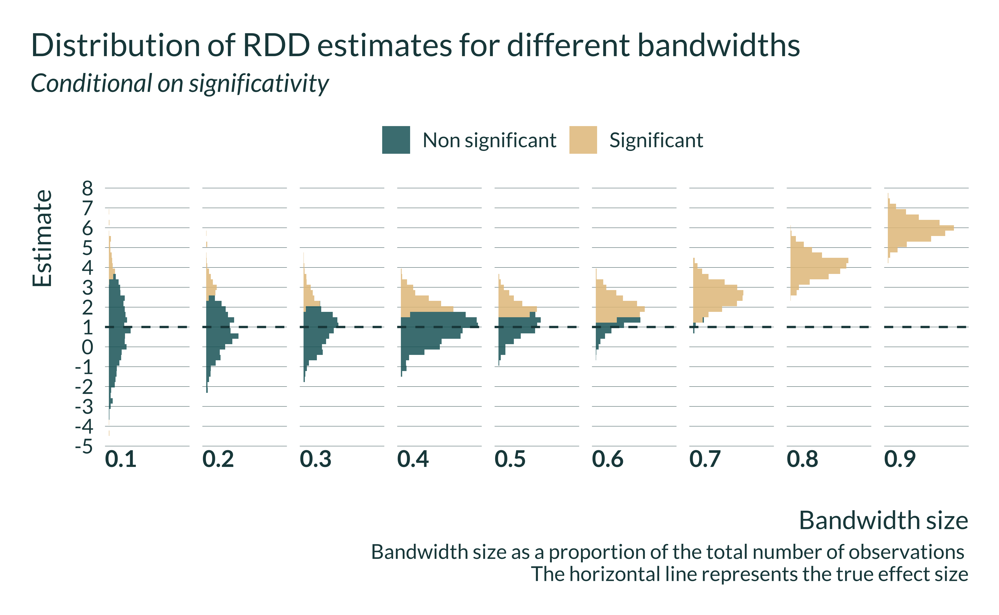
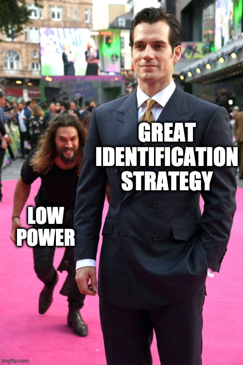

```{r include=FALSE}
library(tidyverse)
library(here)
library(retrodesign)
library(mediocrethemes)
library(AER)
library(ggridges)
library(readxl)
library(gganimate)

setwd(here("Misc/egg_timer_susdever"))
xaringan_mediocre(pal = "coty")

set.seed(1)
```


## Underlying idea

--

- Use causal identification strategies to avoid confounding

--

- They rely on limiting variation

--

- That decreases precision and statistical power

--

- To be significant estimates have to be 2 s.d. away from 0

--

- If power low, they are located in the tails of the distribution

--

- Publication bias $\to$ published estimates may exaggerate true effect

--

- **Trade-off between confounding and exaggeration**

--

- To illustrate this trade-off: simulations

---

```{r echo=FALSE, out.width=1000, fig.align="center"} 

```

---

.pull-left[
## Mechanisms

- RDD: bandwidth size

- IV: "strength" of the instrument

- DiD event studies: number of treated observations

- Matching: caliper

## Hindering the issue

- Report power calculations

- Addressing publication bias

]

.pull-right[
.center[  ]
]


