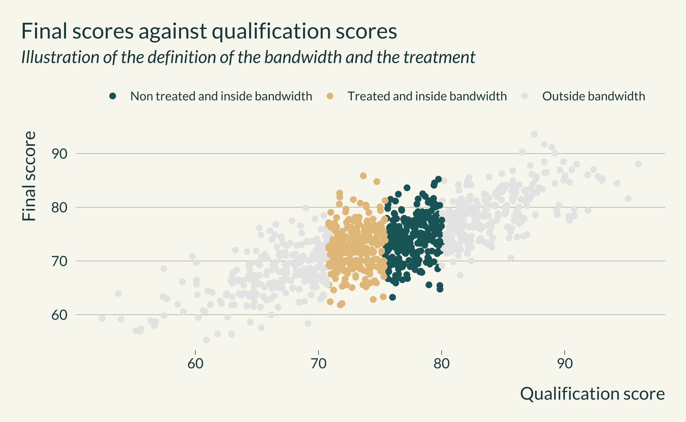
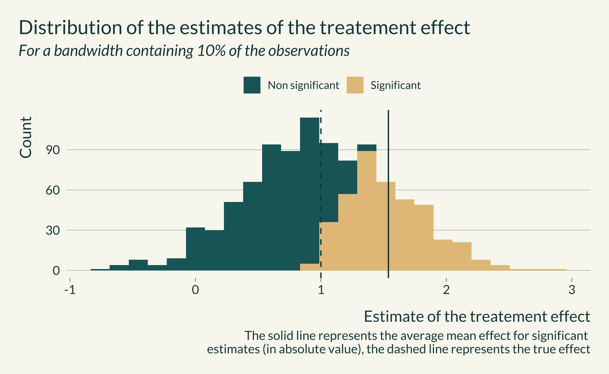
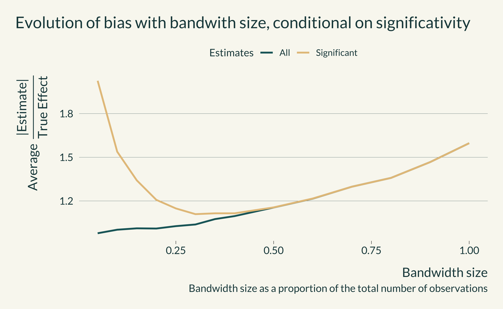
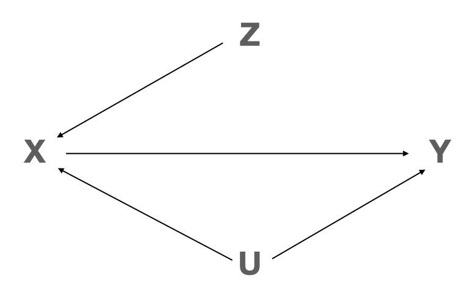
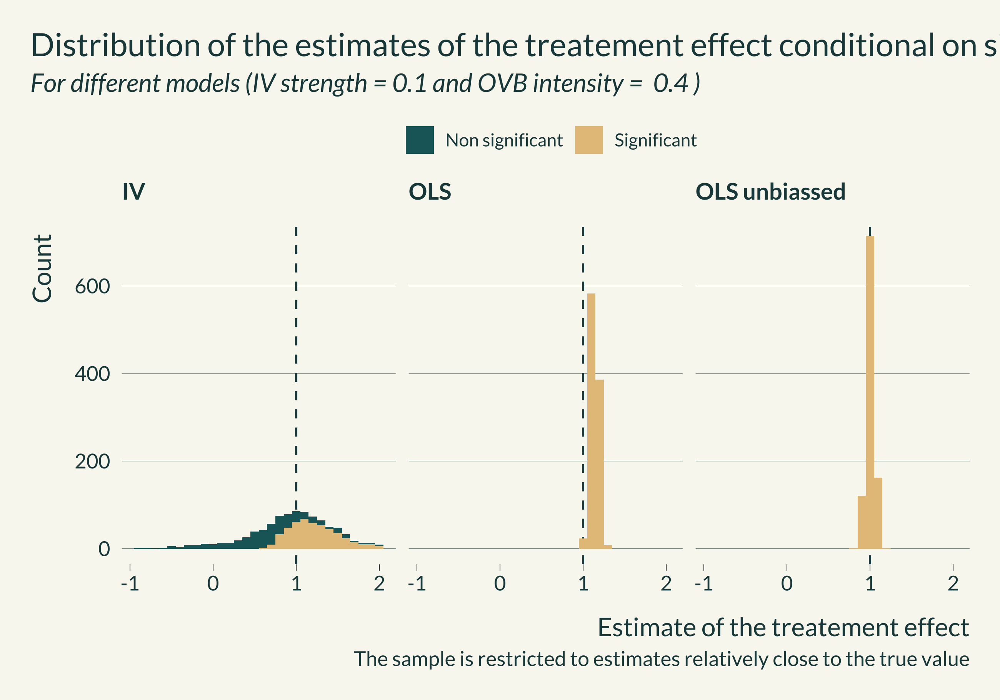
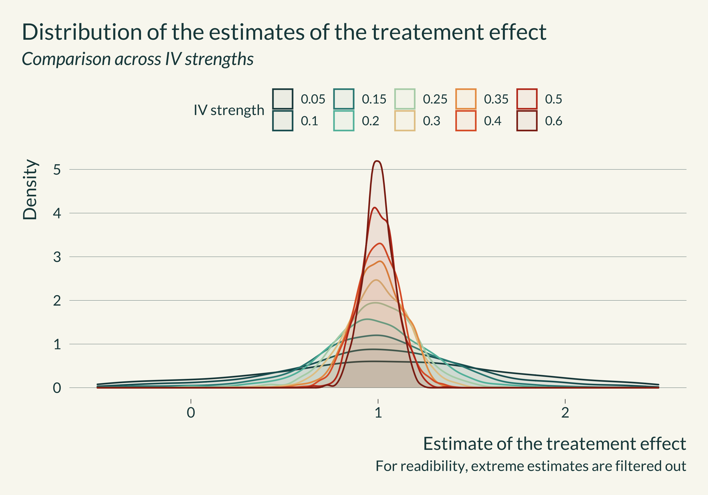
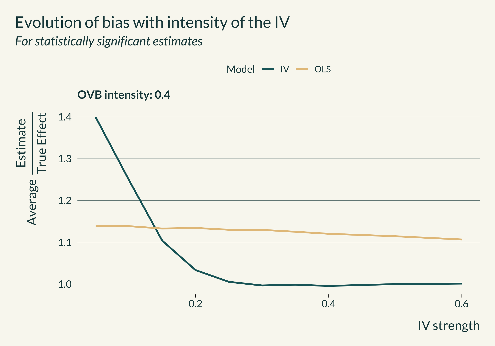

```{r include=FALSE}
library(tidyverse)
library(here)
library(retrodesign)
library(mediocrethemes)
library(AER)
library(ggridges)
library(readxl)
library(gganimate)

setwd(here("Misc/presentation_jeff_lab"))
xaringan_mediocre(pal = "coty")

set.seed(1)
```

## Motivation

- Our main goal is to identify causal effects: need to avoid potential confounders

- Use causal identifications strategies

- They rely on limiting variation, either in X or in the sample size

- Could lead to decrease statistical power

- In this paper, we highlight a trade-off between statistical power and identification strategy

???

- "We all know" that, our main goal as researchers using observational data is to identify causal effects
- To do so, we need to avoid potential **confounders**
- We therefore use causal identifications strategies such as IV, DID, RDD, etc
- "We all know" that these strategies are often really good at avoiding confounders
- Yet, "we also all know" that these causal identification strategies rely on limiting variation, either in X or in the sample size to identify these causal effects. *To develop, a lot*
- Limiting this variation inherently also could lead to decrease statistical power, *ie* the ability to detect an effect when there is actually one.
- More precisely (*need to put the actual neat def*), statistical power is the probability of rejecting the null when the null is false.
- In this paper, we highlight a trade-off between statistical power and identification strategy and illustrate its consequences

---

## Replication crisis

- There is a replication crisis in economics, mostly in lab experiments

- No confounders: how can there be replicability problems in controled environments?

- It could be that the estimates are inflated due to a lack of power

---

## Illustration of the issue

```{r illustration, echo=FALSE, fig.height=4.3, fig.width=9, out.width=1200, dpi = 700}
rep_camerer <- read_excel(here("Misc", "rep_camerer.xlsx"))

random_study <- rep_camerer %>%
  # slice_sample(n = 1) %>%
  slice(10) %>%
  mutate(
    se_original = effect_original/qnorm(1 - pvalue_original), #incorrect
    se_rep = effect_rep/qnorm(1 - pvalue_rep) #incorrect
  )

data_graph_distrib <- rnorm(random_study$effect_rep, random_study$se_original, n = 500) %>%
  as_tibble() %>%
  mutate(
    n = row_number(),
    non_significant = dplyr::between(
      value,
      - 1.96*sd(value),
      1.96*sd(value)
    ),
    significant = ifelse(non_significant, "Non significant", "Significant")
  )

data_graph_distrib %>%
  ggplot(aes(x = n, y = value, color = significant)) +
  geom_point(alpha = 0.8) +
  #original study
  geom_point(aes(x = -30, y = random_study$effect_original), color = "darkred", size = 2) +
  geom_linerange(aes(
    x = -30,
    ymin = random_study$effect_original - 1.96*random_study$se_original,
    ymax = random_study$effect_original + 1.96*random_study$se_original), color = "darkred") +
  #replication
  geom_point(aes(x = -20, y = random_study$effect_rep), color = "darkblue", size = 2) +
  geom_linerange(aes(
    x = -20,
    ymin = random_study$effect_rep - 1.96*random_study$se_rep,
    ymax = random_study$effect_rep + 1.96*random_study$se_rep), color = "darkblue") +
  #repliccation with design of the original study
  geom_point(aes(x = -10, y = random_study$effect_rep), color = "gray50", size = 2) +
  geom_linerange(aes(
    x = -10,
    ymin = random_study$effect_rep - 1.96*random_study$se_original,
    ymax = random_study$effect_rep + 1.96*random_study$se_original), color = "gray50") +
  # geom_hline(aes(yintercept = mean(value)), size = 0.8) +
  geom_hline(aes(yintercept = 0), size = 0.3, linetype = "solid") +
  labs(
    title = "Illustration of type M errors",
    subtitle = "500 draws of an estimate ~ N(Effect size in replication, std err in original study)",
    x = "Draw",
    y = "Point estimate",
    caption = "The red dot represents the estimate found in the original study"
  ) +
  scale_color_discrete(name = "")
  # transition_layers(layer_length = 2, from_blank = FALSE) #to animate

summary_stat_distrib <- data_graph_distrib %>%
  group_by(significant) %>%
  summarise(
    prop = n()/nrow(.),
    mean = mean(value)
  )
```

???

- In red is the estimate from the original study and its 95% confidence interval
- The estimate is significatif and has been published. Yet, it is pretty noisy.
- In blue is the estimate from the replicated study and its 95% confidence interval
- We notice that this second estimate is both more precise and smaller than the initial one. It still remains noisy
- Let's assume that the true effect is actually equal to this second estimate (note that this is unlikely)
- Would the design of the initial study be good enough to detect this true effect? *ie* if we replicated the initial study, could we reject the null of no effect (knowing that the true effect is equal to the replicated estimate)
- In gray is the estimate form the replicated study but with a standard error equal to the initial study's (approximately the standard errors that would have been obtained with the design of the initial study)
- This estimate is non significant. In this instance, we would not have been able to reject the null of no effect
- Now, if we replicate this study 500 times, running 500 lab experiments, in some cases we would get statisitcally significant estimates (the beige dots) and in some others non statistically significant ones (the green dots)
- If we would have been a bit more lucky, we could have gotten a sample of individuals that would have yielded one of the beige estimates
- Now, we notice that, on average, statistically significant estimates overestimate the true effect by a factor 1.7 (average of 0.53 while the true effect is 0.31). Gelman and Carlin call this inflation factor type M error.
- In this case, the power is basically the proportion of statistically significant estimates
- If the study had more power, the sd would be smaller and most estimates would be statistically significative (because there is indeed a non null effect)
- But since the power is low (33%), if by chance the sample of individuals we get yields a statistically significant estimate, this estimate will overestimate the true effect
- One may wonder how power can be that low in experimental setting. To compute power, one needs to make assumption on the true size of the effect. For a fixed design, the larger the true effect, the larger the power. If one is overoptimistic on. Out of luck, they can get effects that are in the same range (especially because the range of possible effects will be very large)
- As seen in this example, a lack of power and statistically significance filter may explain the fact that replicated estimates are often smaller than the initial study (2/3 of the initial estimate sizes in Camerer et al)

---

- Power issue even in controlled settings

- More attention should be devoted to power in observational settings

- In observational settings, also need to take confounders into account

---

## What we do

1. We consider most standard causal inference methods used in the econ literature such as matching, IV, RDD and DiD/event study
2. For each identification strategy:
    - We discuss how key factors (such as the strength of the IV, the bandwidth for the RDD, the number of matched units for matching and ? for DiD) can affect the power of the study and thus create a tension between avoiding confounders and low power
    - Using fake data, we simulate this tension in scenarios based on examples drawn from different econ literatures (Labor econ, education econ, environmental econ and public econ)
3. We discuss potential general avenues to address this problem

---

## Contributions


---
class: inverse, middle, center

# How do we illustrate this trade off?

---
class: middle

- Split the analysis by identification strategy

  - Build fake data simulations

  - Discuss avenues to address this problem for each identification strategy

- Discuss approaches to mitigate this issue

---
class: inverse, middle, center

# RDD

---

- Assume quasi-random allocation at a threshold to get rid of OVB (selection bias)

--

- Example from economics of education

--

```{r echo=FALSE, out.width=400, fig.align="center"} 
knitr::include_graphics("images/DAG_RDD.png")
```

- True DGP: $\small Final_{i} = \alpha_0 + \beta_0 T_i + \gamma_0 Qual_{i} +  \delta_0 U_{i}^{3} + \epsilon_{i}$ 

with $\small Qual_i = H_i + \delta U_i^{3}$ where $\small H \sim \mathcal{N}(\mu_h, \sigma_h^{2})$

- Model: $\small Final_{i} = \alpha + \beta T_i + \gamma Qual_{i} + \epsilon_{i}$

???
- Natural experiment in which researchers exploit a discontinuity in treatment assignation, based on the value of a forcing variable X.  For instance, below a threshold value for X, individuals are deemed treated while individuals above are untreated.
- For values close the threshold, *ie* in a given bandwidth, researchers can make the assumption that treatment assignment is quasi-random, individuals below and above being comparable on average.

---

## Generated data

- Data drawn from normal distributions with realistic parameters
```{r echo=FALSE, out.width=800, fig.align="center"} 

```

---

## Exploration for one simulation
```{r echo=FALSE, out.width=700, fig.align="center"} 

```
- Statistically significant results are on average of the mark of the true effect

---

## THE result graph for RDD

```{r echo=FALSE, out.width=800, fig.align="center"} 

```

---
class: inverse, middle, center

# IV

---

- An unobserved variable affects both dependent and independent variables

--

- Example from environmental econ (?) or trade or ...

--

```{r echo=FALSE, out.width=300, fig.align="center"} 

```

- True DGP: $\small X = \alpha_{x0} + \gamma_0 Z + \delta_{x0} U + e_x$ 

where $\small Z \sim \mathcal{N}(0, \sigma_{z}^{2})$ or $\small Z \sim \text{Bernoulli}(p_z)$

and $\small Y = \alpha_{y0} + \beta X + \delta_{y0} U + e_y$ 

- Model: $\small X = \alpha_x + \gamma_x Z+ e_x$ and $\small Y = \alpha_y + \beta X + e_y$

---

## Exploration for one simulation

```{r echo=FALSE, out.width=600, fig.align="center"} 

```
- Statistically significant results are on average of the mark of the true effect

---

## IV strength and distribution of the estimates

```{r echo=FALSE, out.width=700, fig.align="center"} 

```

---

## THE result graph for IV

```{r echo=FALSE, out.width=700, fig.align="center"} 

```

---
class: inverse, middle, center

# Conclusion

---

## Summary

.pull-left[

- **Objective**: highlight the existence of a trade off between omitted variable bias and type M error

- **Recommendations**:

  - Be mindful of power even in observational studies
  - Run simple pre analysis simulations
  - Perform post analysis robustness checks

]

.pull-right[
.center[  ]
]


---
class: inverse, middle, center

# Next steps

---

- Implement the simulations (if they seem sensible to you)

- Think about take-away messages for each identifications strategy separately

- Think about general take-away messages

- Develop more complex simulations?

- Suggestions?

---
class: inverse, middle, center

# Thank you


