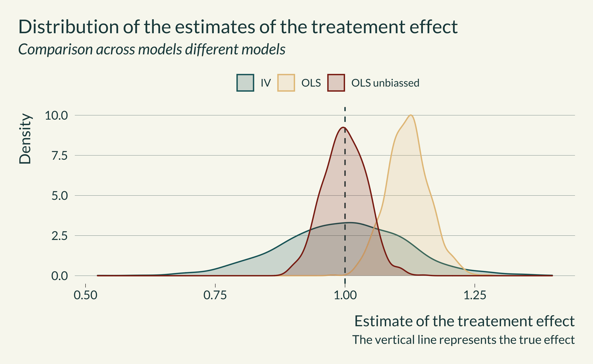
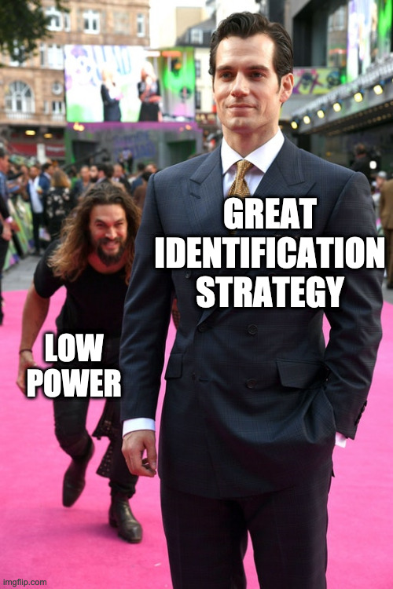

```{r include=FALSE}
library(tidyverse)
library(here)
library(retrodesign)
library(mediocrethemes)
library(AER)
library(ggridges)
library(readxl)
library(gganimate)

setwd(here("Misc/presentation_jeff_lab"))
xaringan_mediocre(pal = "coty")

set.seed(1)
```

## Objectives of this presentation

--

- Is the pitch convincing? How to improve it?

--

- Is the analysis good? How to improve it?

--

- What to develop/simplify?

--

- Structure of the presentation similar to the (forthcoming) paper

???

- The main objective of the paper is to highlight the existence of this trade off between omitted variable bias and type M error
- Very illustrative hence, pitch central
- You know the paper but I will a bit pretend that you don't

- Background: 

  - Submit to a journal like AER: Insights (short format) or to something like Journal of Econometrics
  - 

---
class: inverse, middle, center

# Motivation

---

- Causal identification methods to avoid Omitted Variable Bias (OVB)

--

- Throw away variation $\Rightarrow$ $\searrow$ statistical power

--

- Power **considered** crucial when building RCTs but not in observational studies

--

- With low statistical power, statistically significant estimates overestimate the true effect

--

- Linked to publication bias

--

- Replications of papers produce smaller effects

???

- As economists, obsessed with OVB
- Use neat causal id methods to avoid it
- Successful in getting rid of OVB
- But we know that of ten id strat are associated with decreased statistical power because they throw variation away
- We often do not pay much attention to statistical power
- Statistical power is **basically** the probability of detecting an effect when there is actually one 
- Power **considered** as crucial when building RCTs but much less in later stages and observational studies
- With low statistical power, statistically significant estimates overestimate the true effect
- Linked to publication bias, file drawer problem and statistical significance filter
- This may explain why some replications yield smaller effects (Carmerer et al)

---

## Illustration of the issue

```{r illustration, echo=FALSE, fig.height=4.3, fig.width=9, out.width=1200, dpi = 700}
rep_camerer <- read_excel(here("Misc", "rep_camerer.xlsx"))

random_study <- rep_camerer %>% 
  # slice_sample(n = 1) %>%
  slice(10) %>% 
  mutate(
    se_original = effect_original/qnorm(1 - pvalue_original), #incorrect
    se_rep = effect_rep/qnorm(1 - pvalue_rep) #incorrect
  ) 

data_graph_distrib <- rnorm(random_study$effect_rep, random_study$se_original, n = 500) %>% 
  as_tibble() %>% 
  mutate(
    n = row_number(),
    non_significant = dplyr::between(
      value, 
      - 1.96*sd(value), 
      1.96*sd(value)
    ),
    significant = ifelse(non_significant, "Non significant", "Significant") 
  ) 

data_graph_distrib %>% 
  ggplot(aes(x = n, y = value, color = significant)) + 
  geom_point(alpha = 0.8) +
  #original study
  geom_point(aes(x = -30, y = random_study$effect_original), color = "darkred", size = 2) +
  geom_linerange(aes(
    x = -30,
    ymin = random_study$effect_original - 1.96*random_study$se_original,
    ymax = random_study$effect_original + 1.96*random_study$se_original), color = "darkred") +
  #replication 
  geom_point(aes(x = -20, y = random_study$effect_rep), color = "darkblue", size = 2) +
  geom_linerange(aes(
    x = -20,
    ymin = random_study$effect_rep - 1.96*random_study$se_rep,
    ymax = random_study$effect_rep + 1.96*random_study$se_rep), color = "darkblue") +
  #repliccation with design of the original study
  geom_point(aes(x = -10, y = random_study$effect_rep), color = "gray50", size = 2) +
  geom_linerange(aes(
    x = -10,
    ymin = random_study$effect_rep - 1.96*random_study$se_original,
    ymax = random_study$effect_rep + 1.96*random_study$se_original), color = "gray50") +
  # geom_hline(aes(yintercept = mean(value)), size = 0.8) +
  geom_hline(aes(yintercept = 0), size = 0.3, linetype = "solid") +
  labs(
    title = "Illustration of type M errors",
    subtitle = "500 draws of an estimate ~ N(Effect size in replication, std err in original study)",
    x = "Draw",
    y = "Point estimate",
    caption = "The red dot represents the estimate found in the original study"
  ) +
  scale_color_discrete(name = "")
  # transition_layers(layer_length = 2, from_blank = FALSE) #to animate

summary_stat_distrib <- data_graph_distrib %>% 
  group_by(significant) %>% 
  summarise(
    prop = n()/nrow(.),
    mean = mean(value)
  )
```

???

- Consider the original study (in red): statistically significant, great!
- Now, let's imagine that the replication found the actual true effect of the treatment (dotted line)
- This effect is consistent with what we observed in the initial study (falls within the confidence interval)
- Now, let's assume that we can replicate the initial study 5000 times (knowing that the true effect is equal to the one found in the second study)
- First, we notice that the power is about 35% (the proportion of green points, there is an effect so power is just the proportion of statistically significant points). It is very low
- We see that the the average of all the estimates is equal to the true effect (dotted line) BUT statistically significant estimates are on average larger than the true effect 
- That could not be such a problem but due to publication bias/file drawer problem, studies yielding statistically significant estimates are more likely to be published than those yielding non statistically significant ones, either due to selection/screening by the editor or the authors.
- We can thus consider that, for a given design (question, method, sample size, etc) a study as more chances to be published if the effect found is statistically significant.
- Now if this design has low statistical power, on average a published estimate will overestimate the true effect
- That might be what happened in the case of our replications of RCT: the authors had an imprecise study, they got lucky, they found a significant (and large) effect, they published it in a great journal. 
- Yet, if they would have replicated the study with the same design, they may not have found such a large effect (nor a statistically significant one)

---

## Lessons

- Even RCTs can be wide of the mark of the true effect

- Be mindful of power, in every step of the analysis

- Concerns might be even more prevalent in other identification strategies

## Objective

- Highlight the existence of a trade off between omitted variable bias and type M error


???

- How did we get there? We had an RCT but we fell of the mark of the true effect
- The issue of inflated effect sizes due to low power is not new: several studies underlined this issue in psychology (citation), econ (ioannidis), epidemiology and medecine (citations).
- Power was definitely too small. How can this be? 
- When designing a RCT, we define the sample size to have enough power. But this relies on an hypothesized true effect size. If this hypothetical true effect size is too large, for a given design, we will overestimate the power and can then fall into type M error problems.
- We should therefore also  check the power at the end of the analysis (running robustness tests with true effects as fraction of the estimated effect. But we will develop this later)
- If find that risk of low power, increase the sample size to increase power (but of course it costs money so there is a trade off here)
- That illustrates that even RCTs can yield published estimates that are wide of the mark of the true effect
- 


---
class: inverse, middle, center

# Why could some identification strategies have low power?

---

## Summary of the core issue

.pull-left[

1. We fear omitted variable biases

1. We develop neat identification strategies

1. It sometimes lead to low power

1. It creates type M error

1. The value obtained is wide of the mark of the true effect

]

.pull-right[
.center[  ]
]

---

### RDD
  
- When $\searrow$ bandwidth,
- omitted variable bias $\searrow$
- **BUT** throw away units outside the bandwidth
- number of observations also $\searrow$ 
- so power $\searrow$ and type M error $\nearrow$

--

### Matching

- When $\searrow$ caliper (*ie* only match the most similar units),
- omitted variable bias $\searrow$
- **BUT** throw away non matched units
- number of observations also $\searrow$ 
- so power $\searrow$ and type M error $\nearrow$

---

### IV
```{r echo=FALSE, out.width=700, fig.align="center"} 

```
- Lower power than OLS and thus higher type M error
  
<!-- --- -->

<!-- - **DID**:  -->

---

### DID

- When $\searrow$ number of clusters,
- omitted variable bias $\searrow$ (more agnostic about the correlation structure)
- **BUT** the effective number of observations $\searrow$ 
- so power $\searrow$ 
- type M error $\nearrow$

--

### DiD (alternative)

- When $\searrow$ number of time periods considered before and after treatment,
- omitted variable bias $\searrow$
- **BUT** the number of observations $\searrow$ 
- so power $\searrow$ 
- type M error $\nearrow$ 
  
---

### Event study

- Example: health impact of plant shutdown on health (via air pollution)
- Compare the event study to simple regression of health on pollution
 
--
  - When $\searrow$ number of events
  - variation used to estimate the effect $\searrow$ 
  - so power $\searrow$ 
  - type M error $\nearrow$ 
  

---
class: inverse, middle, center

# How do we illustrate this trade off?

---
class: middle

- Split the analysis by identification strategy

  - Build fake data simulations

  - Discuss avenues to address this problem for each identification strategy

- Discuss approaches to mitigate this issue

---
class: inverse, middle, center

# RDD

---

- Assume quasi-random allocation at a threshold to get rid of OVB (selection bias)

--

- Example from economics of education

--

```{r echo=FALSE, out.width=400, fig.align="center"} 

```

- True DGP: $\small Final_{i} = \alpha_0 + \beta_0 T_i + \gamma_0 Qual_{i} +  \delta_0 U_{i}^{3} + \epsilon_{i}$ 

with $\small Qual_i = H_i + \delta U_i^{3}$ where $\small H \sim \mathcal{N}(\mu_h, \sigma_h^{2})$

- Model: $\small Final_{i} = \alpha + \beta T_i + \gamma Qual_{i} + \epsilon_{i}$

???
- Natural experiment in which researchers exploit a discontinuity in treatment assignation, based on the value of a forcing variable X.  For instance, below a threshold value for X, individuals are deemed treated while individuals above are untreated.
- For values close the threshold, *ie* in a given bandwidth, researchers can make the assumption that treatment assignment is quasi-random, individuals below and above being comparable on average.

---

## Generated data

- Data drawn from normal distributions with realistic parameters
```{r echo=FALSE, out.width=800, fig.align="center"} 
knitr::include_graphics("images/graph_bandwidth_RDD-1.png")
```

---

## Exploration for one simulation
```{r echo=FALSE, out.width=700, fig.align="center"} 

```
- Statistically significant results are on average of the mark of the true effect

---

## THE result graph for RDD

```{r echo=FALSE, out.width=800, fig.align="center"} 

```

---
class: inverse, middle, center

# IV

---

- An unobserved variable affects both dependent and independent variables

--

- Example from environmental econ (?) or trade or ...

--

```{r echo=FALSE, out.width=300, fig.align="center"} 
knitr::include_graphics("images/DAG_IV.png")
```

- True DGP: $\small X = \alpha_{x0} + \gamma_0 Z + \delta_{x0} U + e_x$ 

where $\small Z \sim \mathcal{N}(0, \sigma_{z}^{2})$ or $\small Z \sim \text{Bernoulli}(p_z)$

and $\small Y = \alpha_{y0} + \beta X + \delta_{y0} U + e_y$ 

- Model: $\small X = \alpha_x + \gamma_x Z+ e_x$ and $\small Y = \alpha_y + \beta X + e_y$

---

## Exploration for one simulation

```{r echo=FALSE, out.width=600, fig.align="center"} 

```
- Statistically significant results are on average of the mark of the true effect

---

## IV strength and distribution of the estimates

```{r echo=FALSE, out.width=700, fig.align="center"} 
knitr::include_graphics("images/exploration_results_IV-2.png")
```

---

## THE result graph for IV

```{r echo=FALSE, out.width=700, fig.align="center"} 
knitr::include_graphics("images/graph_results_IV-1.png")
```

---
class: inverse, middle, center

# Conclusion

---

## Summary

.pull-left[

- **Objective**: highlight the existence of a trade off between omitted variable bias and type M error

- **Recommendations**: 

  - Be mindful of power even in observational studies
  - Run simple pre analysis simulations
  - Perform post analysis robustness checks

]

.pull-right[
.center[  ]
]


---
class: inverse, middle, center

# Next steps

---

- Implement the simulations (if they seem sensible to you)

- Think about take-away messages for each identifications strategy separately

- Think about general take-away messages

- Develop more complex simulations?

- Suggestions?

---
class: inverse, middle, center

# Thank you


