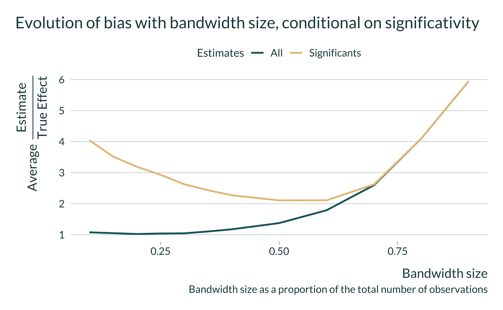
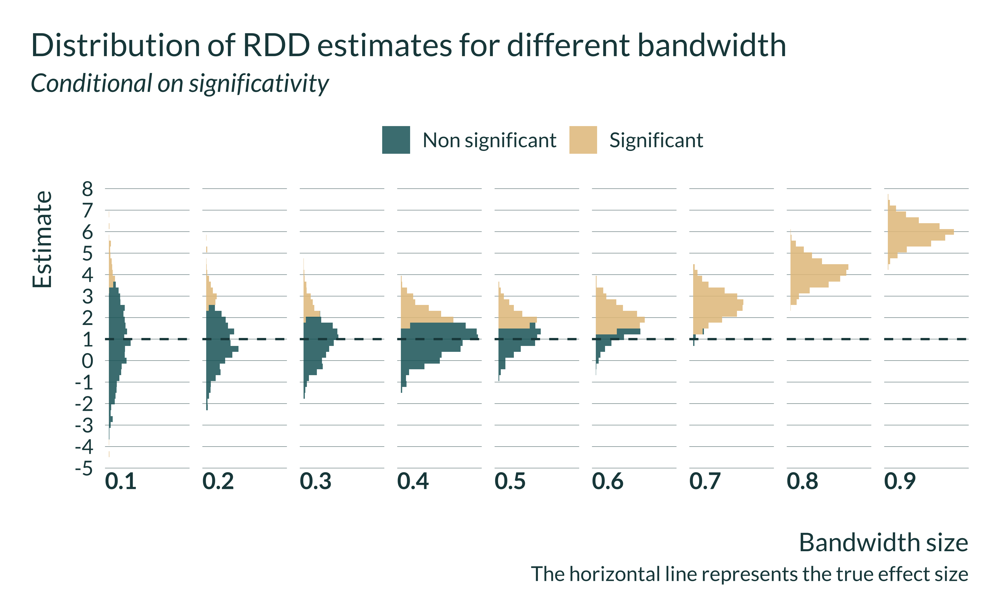
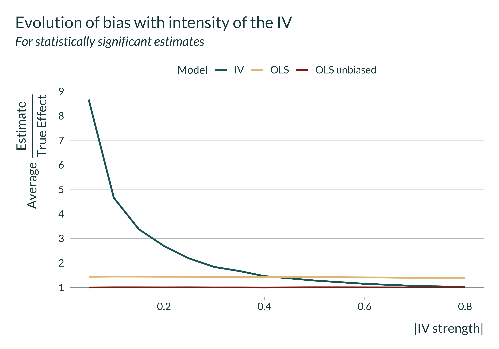
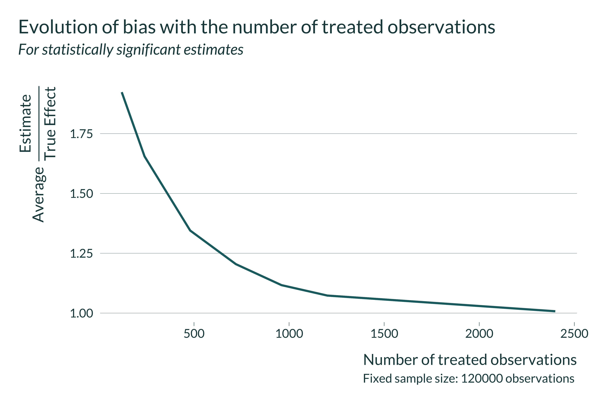
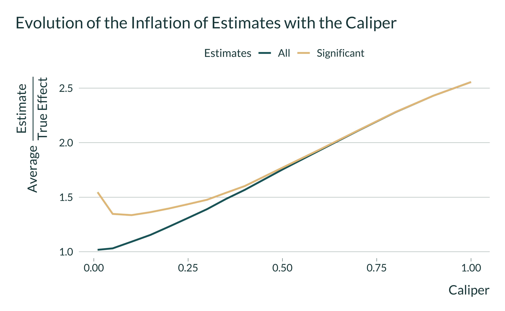

```{r include=FALSE}
library(tidyverse)
library(here)
library(retrodesign)
library(mediocrethemes)
library(AER)
library(ggridges)
library(readxl)
library(gganimate)

setwd(here("Misc/presentation_gelman"))
xaringan_mediocre(pal = "coty")

set.seed(1)
```


## Quick summary of the project

- Use fake data simulations to illustrate the existence of a trade off between confounders and type M error

- Audience: researchers in econ using observational data

- Pending questions: 

  - Which tools to highlight the actual variation used for identification?
  
  - Other "solutions" to the problem we underline?

---

## The trade-off we illustrate

--

- Causal identification strategies to avoid confounders

--

- Rely on limiting variation (in X or sample size)

--

- Decreases statistical power

--

- Risk of type M error

--

- Estimated effect may be wide of the mark of the true effect

--

- Our paper discusses consequences of this power/identification strategy trade off

- We focus on OVB

---

## Causal identification strategies throw out variation

- **IV**: only uses part of the variation in X

- **RDD**: only uses a fraction of the sample

- **Matching**: only uses a fraction of the sample

- **DiD/event study**: limits variation in X by considering only a small number of events 

---

## What we did

- Build fake data simulations: replicate example from a different econ field for each method

- Advocate reporting power calculations for alternative effect sizes

## What we still need to do

- We **may** derive the mathematical characterization for the IV

- Point to a tool to identify where the variation used for identification comes from (*eg* a tool to compute the effective sample size)
 
???

- we also recommend researchers to think about power in every stage of their analysis and to think about potential true effect sizes

---

## Results for RDD

```{r echo=FALSE, out.width=800, fig.align="center"} 

```
---

## Results for RDD

```{r echo=FALSE, out.width=800, fig.align="center"} 

```

---

## Results for IV

```{r echo=FALSE, out.width=700, fig.align="center"} 

```

---

## Results for DiD

```{r echo=FALSE, out.width=800, fig.align="center"} 

```
---

## Results for matching

```{r echo=FALSE, out.width=800, fig.align="center"} 

```


---

## My questions

- Should we derive the actual maths or simulations are enough?

- Which tools to highlight the actual variation used for identification?
  
- Other "solutions" to the problem we underline?


