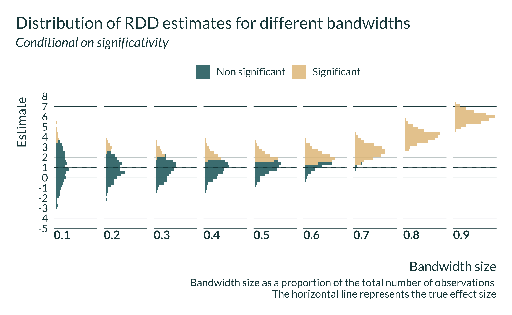
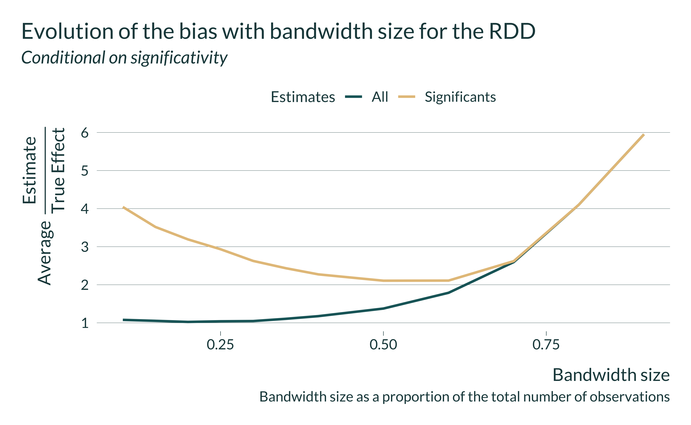
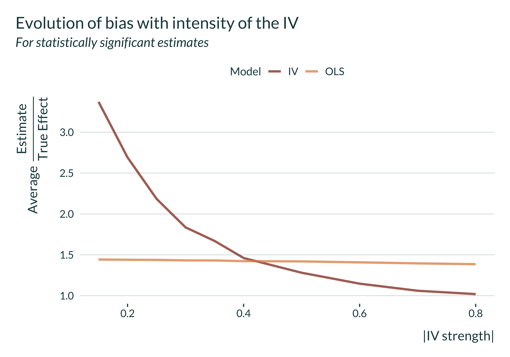
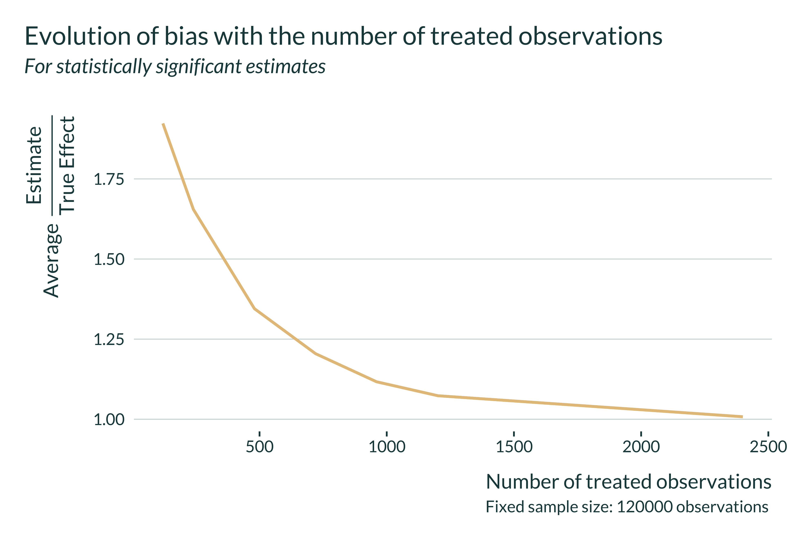
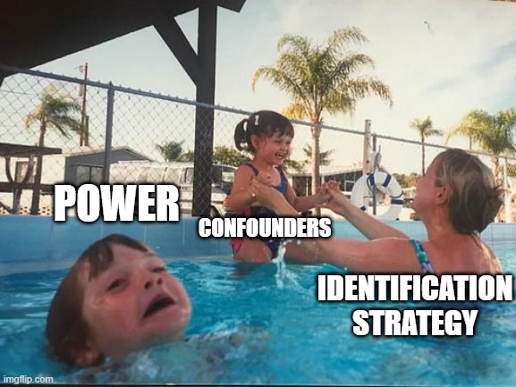

```{r setup_summary, include=FALSE, results='hide', warning=FALSE}
library(knitr)
opts_chunk$set(fig.path = "images/",
               cache.path = "cache/",
               cache = FALSE,
               echo = TRUE, #set to false to hide code
               message = FALSE,
               warning = FALSE,
               out.width = "85%",
               dpi = 300,
               fig.align = "center",
               dev.args = list(bg="transparent"))  
```  

```{r packages_summary, message=FALSE, warning=FALSE, include=FALSE}
library(tidyverse) 
library(knitr) 
library(mediocrethemes)

set.seed(3)

set_mediocre_all(pal = "coty")
```

## Plain language summary

*In this paper, we show that, combined with current academic publication practices, front line empirical methods, while efficient to identify how a factor causes another, may be more likely to face a statistical issue that leads reported effects to larger than what they should be.*

Empirical studies often aim to get a sense of how a factor *causes* another. For instance, one may want to evaluate the impact of a professional training program on wages. Such effects are often challenging to estimate. A simple difference between the wages of people who participated in the program or not may not reflect the actual wage increase brought by the program. It might be the case that people who participated in the program would have earned higher wages even if they did not take the training. To measure the actual magnitude of the effect of the program, researchers use a particular set of methods. These methods while convincing may be imprecise. On average, if one could reproduce the analysis many times, they would yield the true effect of the training program. Yet, analyses are often only carried out once for cost reasons. The lack of precision of the methods means that a particular study can produce results that are quite far away from the true effect.
<!-- In this paper, we show how academic publication practices can lead these otherwise effective methods to yield incorrect estimates of the effect size.  -->

On the other hand, previous research has shown that publication practices favor results that are very clearly different from zero; published results are often far away from zero. Now, if the true effect is close to zero and the study imprecise, the published result will not only be far away from zero but also from the true effect. 
<!-- Effects that are too small to -->

The set of methods mentioned above enables to convincingly measure the effect of a factor on another. However, they are also more subject to the publication problem and may be more likely to exaggerate effect sizes. In this paper, we show that there is a trade-off between measuring an actual causal impact and exaggerating efffect sizes due to the publication problem discussed above.

To do so we build simulations, generating fake data representative of real life situations. We have to rely on simulations because to evaluate how far the result of an analysis is from the true effect, one needs to know this true effect. In real life cases, the true effect is never known (otherwise we would not build a study to estimate it).

To avoid published effects to exaggerate true effect sizes, we advocate computing and reporting a very simple calculation that may help evaluate the risk of exaggeration.

<!-- ```{r} -->
<!-- n <- 200 -->
<!-- true_effect <- 1 -->
<!-- se <- 1 -->

<!-- tibble(estimate = rnorm(200, true_effect, se)) %>%  -->
<!--   mutate(significant = (abs(estimate) > 1.96*se)) %>%  -->
<!--   ggplot(aes(x = estimate, color = significant, fill = significant)) + -->
<!--   geom_dotplot() -->
<!-- ``` -->


## A Twitter summary

#### Tweet 1/N

We published a working paper arguing that causal inference methods can produce inflated published estimates.

They intrinsically reduce statistical power. It creates a trade-off between confounding and exaggerating true effect sizes.

#### Tweet 2/N

When power is low, the distribution of estimates is spread out. Only estimates that are roughly 2 sd away from 0 are statistically significant. Significant estimates overestimate the true effect size.

```{r illustration_typeM, echo = FALSE}
n_iter <- 5000
true_effect <- 0.8
sd <- 1

tibble(estimate = rnorm(true_effect, sd, n = n_iter)) %>% 
  mutate(
    n = row_number(),
    non_significant = dplyr::between(
      estimate, 
      - 1.96*sd(estimate), 
      1.96*sd(estimate)
    ),
    significant = ifelse(non_significant, "Non significant", "Significant") 
  ) %>% 
  ggplot(aes(x = estimate, fill = significant)) +
  geom_histogram() +
  geom_vline(xintercept = true_effect) +
  labs(
    title = "Illustration of the exaggeration and power issues",
    subtitle = str_c(
      "Distribution of ", n_iter,
      " draws of an estimate ~ N(", true_effect, ",", sd, ")"),
    x = "Point estimate",
    y = "Count",
    fill = "",
    caption = "The vertical line represents the true effect"
  ) 
  
```

#### Tweet 3/N

Causal id strat throw out part of the variation, reducing power, leading significant estimates to exaggerate true effects sizes. The same aspect that makes causal identification strategies credible can also induce "bias".

We build fake data MC simulations to illustrate this.

#### Tweet 4/N

RDD discards variation by only considering observations within the bandwidth. It decreases the effective sample size.

On average significant estimates may never get close to the true effect.

```{r echo=FALSE, fig.align="center"} 


```

#### Tweet 5/N

IV only uses part of the variation in the treatment, the portion explained by the instrument. When the "strength" of the instrument is low, the IV is imprecise. 

A "naive" OLS can, on average, produce significant estimates that are closer to the true effect than the IV.

```{r echo=FALSE, fig.align="center"} 

```

#### Tweet 6/N

In DiD event studies, the variation used to identify an effect sometimes only comes from a limited number of treated observations. Power can thus be low and estimates inflated.

```{r echo=FALSE, fig.align="center"} 

```

#### Tweet 7/N

Matching prunes treated units that cannot be matched to untreated ones, reducing the effective sample size.

On average significant estimates may never get close to the true effect.

```{r echo=FALSE, fig.align="center"} 

```

#### Tweet 8/N

A systematic reporting of pre and post analysis power calculations in observational studies would help gauge the risk of falling into this low power trap.

#### Tweet N/N

The paper summed up in a picture:

```{r echo=FALSE, out.width=400, fig.align="center"} 

```


## Abstract

Convincing research designs make empirical economics credible. To avoid confounding, quasi-experimental studies focus on specific sources of variation. This often leads to a reduction in statistical power. Yet, published estimates can overestimate true effects sizes when power is low. Using fake data simulations, we show that for all causal inference methods, there can be a trade-off between confounding and exaggerating true effect sizes due to a loss in power. We then discuss how reporting power calculations could help address this issue.


